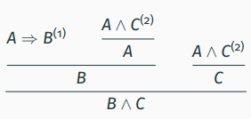

# Lecture 13
*"Every good idea will be discovered twice: once by a logician and once by a computer scientist"* - Philip Wadler

Today's topic is a good example - it is a bridge between logic and CS.

### Lecture plan
* dependent types quiz
* logic as a type system
* classical logic vs. constructive logic
* predicate logic with 'for all' quantifiers
* the identity type

### Recap: dependent types
A dependent type is a type that depends on a value of some base type.

With dependent types, we can specify the allowed inputs of a function more precisely, ruling out invalid inputs at compile time.

**Examples:**
* `Food f`, indexed over `f : Flavour`
* `Vec A n`, indexed over `n : Nat`
* `Fin n`, indexed over `n : Nat`
* `If T b A B`, indexed over `b : Bool`

## The Curry-Howard correspondence

### Formal verification with dependent types
**Reminder**: Formal verification is the process of proving correctness of programs with respect to a certain formal specification.

Our goal is to use Agda as a proof assistant for doing formal verification. To do this, we first need to answer the
question: what exactly is a proof?


### What is a proof?
**Attempt 1:**
Traditionally, a proof is a sequence of statements, where each statement is a direct consequence of previous statements.

**Example**: A proof that if (1) A ⇒ B and (2) A ∧ C,
then B ∧ C:
(3) A (follows from 2)
(4) C (follows from 2)
(5) B (follows from 1 and 3)
(6) B ∧ C (follows from 4 and 5)

**Attempt 2**: Let's improve the definition to be more suited  for our use case. We can make the dependencies of a proof more explicit by writing it down as a proof tree.

**Example:** Here is the same proof that if (1) A ⇒ B and (2) A ∧ C, then B ∧ C:




To represent these proofs in a programming language, we can annotate each node of the tree with a proof term:


Hmm, these proof terms start to look a lot like functional programs...

### The Curry-Howard correspondence
We can interpret logical propositions  (A ∧ B, ¬A, A ⇒ B, ...) as the types of all their possible proofs.

In particular: A false proposition has no proofs, so it corresponds to an
**empty type**.

### What is conjunction A ∧ B?
What do we know about the proposition A ∧ B?
* To prove A ∧ B, we need to provide a proof of A and a proof of B
* Given a proof of A ∧ B, we can get proofs of A and B

The type of proofs of A ∧ B is the product type `A × B`.

### What is implication A ⇒ B?
What do we know about the proposition A ⇒ B?
* To prove A ⇒ B, we can assume we have a proof of A and have to provide a proof of B
* From a proof of A ⇒ B and a proof of A, we can get a proof of B

The type of proofs of A ⇒ B is the function type `A → B`.

### What is disjunction A ∨ B?
What do we know about the proposition A ∨ B?
* To prove A ∨ B we need to provide a proof of A or a proof of B
* We can prove C if we have the following:
    * a proof of A ∨ B
    * a proof of C assuming a proof of A
    * a proof of C assuming a proof of B

The type of proofs of A ∨ B is the sum type `Either A B`.

### What is truth?
What do we know about the proposition 'true'?
* to prove 'true', we don't need to provide anything
* from 'true', we can deduce nothing

The type of proofs of truth is the *unit* type `T`, with one constructor `tt`:
```haskell
data T : Set where
    tt : T
```

### What is falsity?
What do we know about the proposition 'false'?
* There is no way to prove 'false'
* From a proof t of 'false', we get a proof 'absurd t' of any proposition A

The type of proofs of falsity is the empty type ⊥:
```haskell
data ⊥ : Set where
```

### Curry-Howard for propositional logic
We can translate from the language of logic to the language of types according to this table:


### Derived notions 
**Negation**: We can encode ¬P (“not P”) as the type P → ⊥.

**Equivalence**: We can encode P ⇔ Q (“P is equivalent to Q”) as (P → Q) × (Q → P).

### An exercise on translation
**Exercise**: Translate the following statements to types in Agda, an prove them by constructing a program of that type:
1. If A and A implies B, then B
2. If A implies B and B implies C, then A implies C
3. If A is false and B is false, then (either A or B) is false.

**Answer**:
```haskell
example₁ : {A B : Set} → A × (A → B) → B
example₁ (x , f) = f x

example₂ : {A B C : Set} → ((A → B) × (B → C)) → A → C
example₂ (f , g) = λ x → g (f x)

example₃ : {A B : Set} → ((A → ⊥) × (B → ⊥)) → (Either A B → ⊥)
example₃ (f , g) = λ x → cases x f g
```

### Three layers of Curry-Howard
1. Propositions are types
2. Proofs are programs
3. Simplifying a proof is evaluating a program

**Example**: An indirect proof of A → A evaluates
to direct proof:
```haskell
x → (λ y → fst y) (x, x)
−→ λ x → fst (x, x)
−→ λ x → x
```

## Classical vs. constructive logic
### Non-constructive statements:
In classical logic, we can prove certain 'non-constructive' statements:
* P ∨ (¬P) (excluded middle)
* ¬¬P ⇒ P (double negation elimination)

However, Agda uses a constructive logic: a proof of A ∨ B gives us a decision procedure to tell whether A or B holds.

When P is unknown, it's impossible to decide whether P or ¬P holds, so the excluded middle is unprovable in Agda.

### From classical to constructive logic
Consider the proposition P (“P is true”) vs. ¬¬P (“It would be absurd if P were false”).

Classical logic can’t tell the difference between the two, but constructive logic can.
**Theorem:** P is provable in classical logic if and only if ¬¬P is provable in constructive logic. (proof by Gödel and Gentzen)

## Predicate logic
### Curry-Howard beyond simple types
* classical logic corresponds to continuations (e.g. Lisp)
* linear logic corresponds to linear types (e.g. Rust)
* predicate logic corresponds to dependent types (e.g. Agda)

### Proving things about programs
So far, we have encoded logical propositions as types and proofs as programs of these types, but there is no interaction yet between the
‘program part’ and the ‘proof part’ of Agda. 

**Question**: Can we use the ‘proof part’ to prove things about the ‘program part’?

**Answer**: Yes, we can define propositions that depend on (the output of) programs by using dependent types!

### Example: a predicate for evenness
```haskell
data IsEven : Nat → Set where
    e-zero : IsEven zero
    e-suc2 : {n : Nat} →
        IsEven n → IsEven (suc (suc n))

6-is-even : IsEven 6
6-is-even = e-suc2 (e-suc2 (e-suc2 e-zero))

7-is-not-even : IsEven 7 → ⊥
7-is-not-even (e-suc2 (e-suc2 (e-suc2 ())))
```

### Universal quantification
What do we know about the proposition ∀(x ∈ A). P(x) (‘for all x in A, P(x) holds’)?
* To prove ∀(x ∈ A). P(x), we assume we have an unknown x ∈ A and prove that P(x) holds.
* If we have a proof of ∀(x ∈ A). P(x) and a concrete a ∈ A, then we know P(a).

∀(x ∈ A). P(x) corresponds to the dependent function type `(x : A) → P x`

### Universal quantification: example
Example. We can state and prove that for any number `n : Nat`, `double n` is even:

```haskell
double : Nat → Nat
double zero = zero
double (suc m) = suc (suc (double m))
double-even : (n : Nat) → IsEven (double n)
double-even zero = e-zero
double-even (suc m) = e-suc2 (double-even m)
```

### Writing proofs as functional programs
We can use familiar syntax from functional programming to write proofs:
* We can do a proof by cases using pattern matching.
* We can use induction by making recursive calls to the proof.

### On the need for totality
To ensure the proofs we write are correct, we rely on the totality of Agda:
* The coverage checker ensures that a proof by cases covers all cases.
* The termination checker ensures that inductive proofs are well-founded.

### A predicate for being true
We can define a predicate `IsTrue` that allows us to use boolean functions as predicates.
```haskell
data IsTrue : Bool → Set where
is-true : IsTrue true
```

* If `b = true`, then `IsTrue b` has exactly one element is-true
* If `b = false`, then `IsTrue b` has no elements: it is an empty type

### Using the isTrue predicate
```haskell
_=Nat_ : Nat → Nat → Bool
zero =Nat zero = true
(suc x) =Nat (suc y) = x =Nat y
_ =Nat _ = false
length-is-3 : IsTrue (length (1 :: 2 :: 3 :: []) =Nat 3)
length-is-3 = is-true
```

### Another example: `n` is equal to itself

Let's prove that any number is equal to itself:
```haskell
n-equals-n: (n: Nat) → IsTrue (n =Nat n)
n-equals-n n = is-true
```

This code results in an error: `true != n =Nat n of type Bool`. 
**Question**: What did we do wrong?
**Answer**: Since `_Nat_` is defined by pattern matching and recursion, the proof must do the same:
```haskell
n-equals-n : (n : Nat) → IsTrue (n =Nat n)
n-equals-n zero = is-true
n-equals-n (suc m) = n-equals-n m
```

### Existential quantification
What do we know about existential quantification ∃(x ∈ A). P(x) (“there exists x ∈ A such that P(x)”)?
* To prove ∃(x ∈ A). P(x), we need to provide some v ∈ A and a proof of P(v).
* From a proof of ∃(x ∈ A). P(x), we can get some v ∈ A and a proof of P(v).

The proposition ∃(x ∈ A). P(x) corresponds to the type `Σ A B` of pairs `(v, p)` where the type
of `p` depends on the value of `v`.

### Proving an existential statement
Example. Prove that there exists a number `n` such that `n + n = 12`:
```haskell
half-a-dozen : Σ Nat (λ n → IsTrue ((n + n) =Nat 12))
half-a-dozen = 6 , is-true
```

Here the second component `is-true` has type `IsTrue ((6 + 6) =Nat 12)`.

## The identity type
The type `isTrue` encodes the property of being equal to `true: Bool`:
```haskell
data IsTrue : Bool → Set where
is-true : IsTrue true
```
We can generalize this to the property of two elements of some type `A` being equal:
```haskell
data _≡_ {A : Set} : A → A → Set where
refl : {x : A} → x ≡ x
```

### Using the identity type
If `x` and `y` are equal, `x ≡ y` has one constructor `refl`:
```haskell
one-plus-one : 1 + 1 ≡ 2
one-plus-one = refl
```
If `x` and `y` are not equal, `x ≡ y` is an empty type:
```haskell
zero-not-one : 0 ≡ 1 → ⊥
zero-not-one ()
```

### Proving correctness of functions
We can use the identity type to prove the correctness of functional programs.

**Example**: Prove that `not (not b) ≡ b` for all `b : Bool`:
```haskell
not-not : (b : Bool) → not (not b) ≡ b
not-not true = refl
not-not false = refl
```
More about this next lecture!